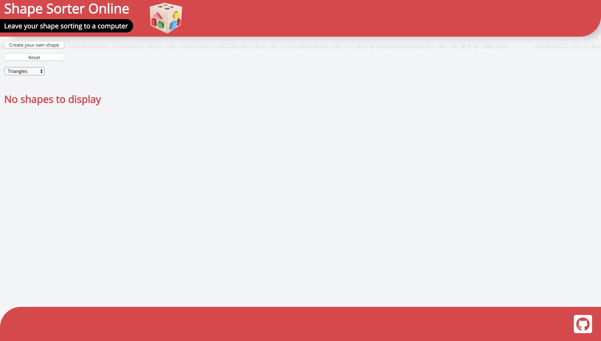
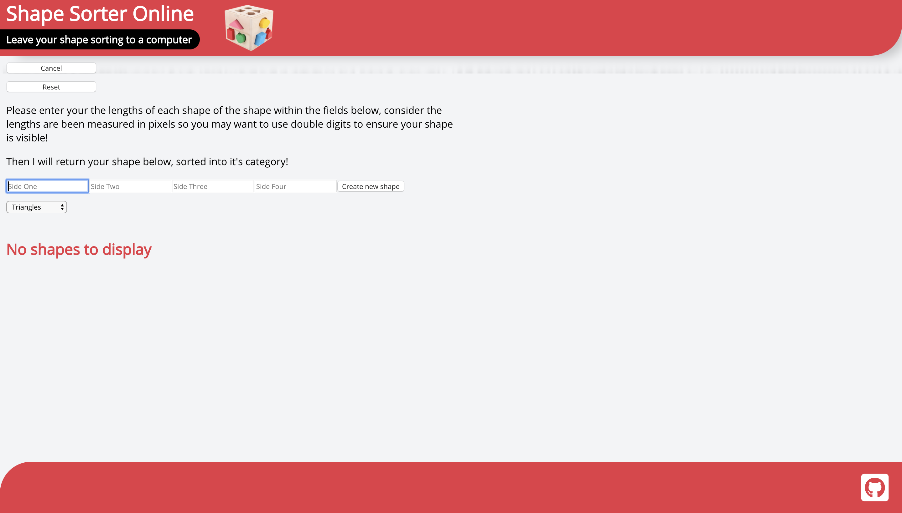
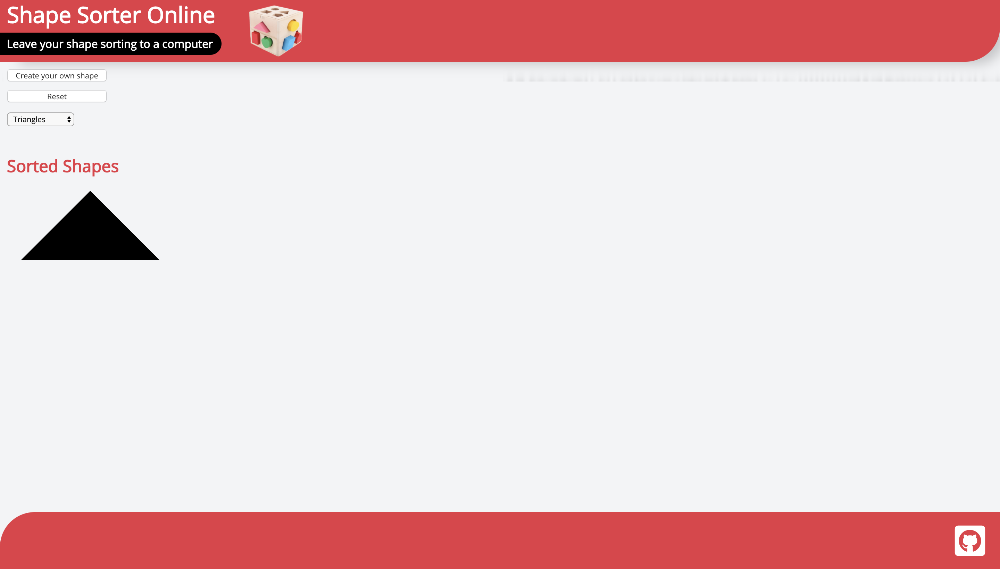
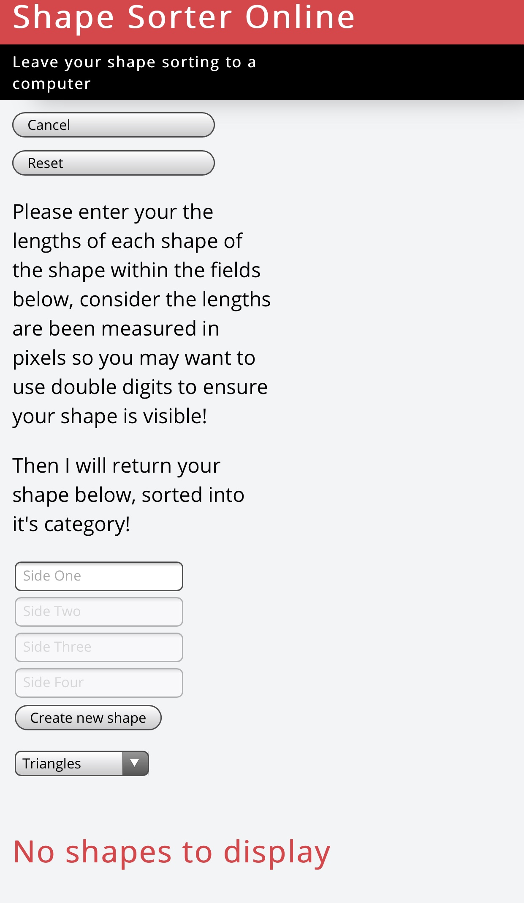
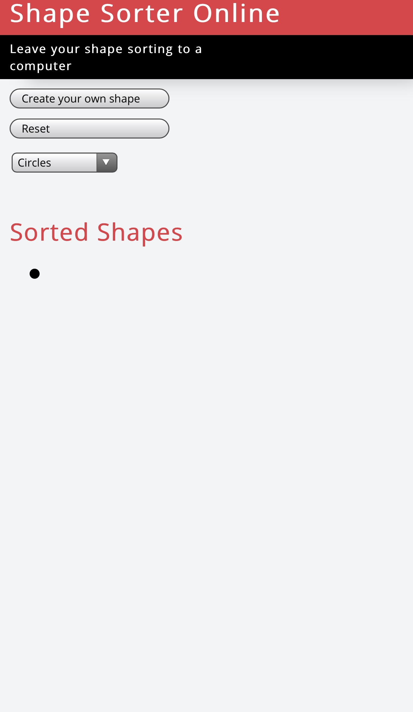
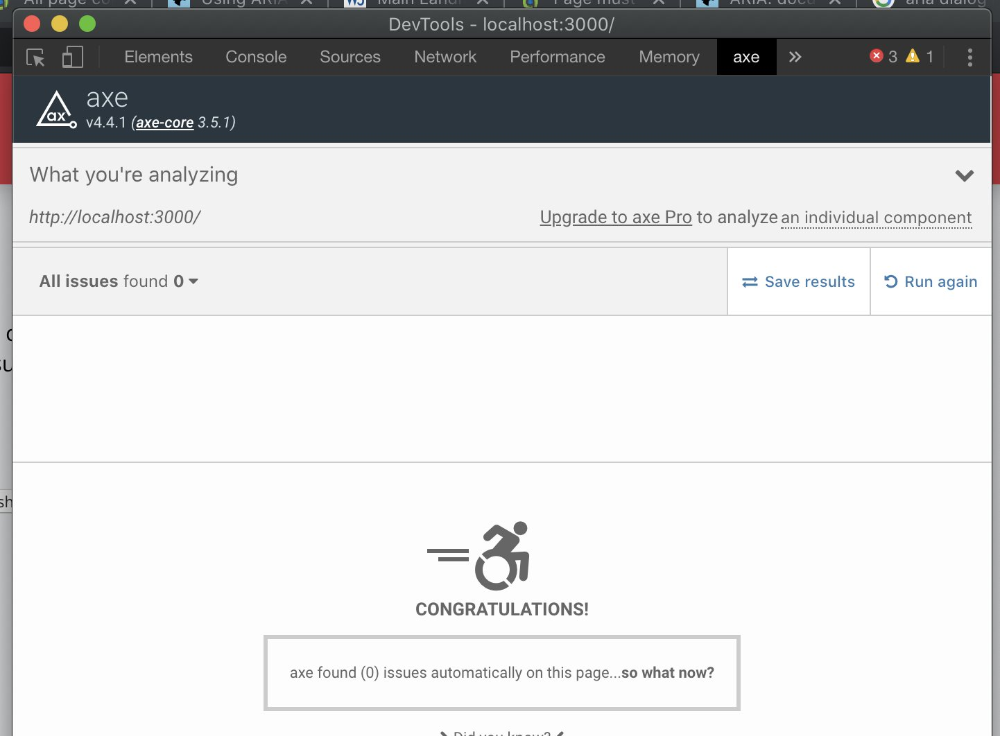

# Shape Sorter Online - Leave your shape sorting in the hands of a computer

[Deployed Site](https://shapesorteronline.netlify.app/)

This application was made in response to the challenge 'Build an application that sorts the following shapes: Circles, Triangles and Quadrilaterals.
 
In the future I may revisit it to create a deeper filter, which would return more shapes such as ovals, scalene triangles, etc.  

#### Tech

- React
- Redux
- Konva
- Enyzme
- Enyzme to Json

#### Command line inputs

npm i  
npm test  
npm start  

# Desktop Screenshots

### Dashboard

### Create your own shape

### Created shape

# Mobile Screenshots

### Create your own shape

### Created shape

# Accessability

